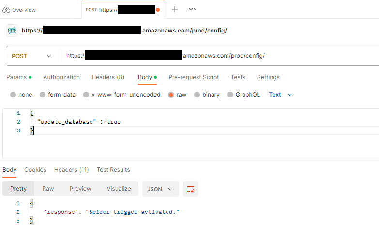
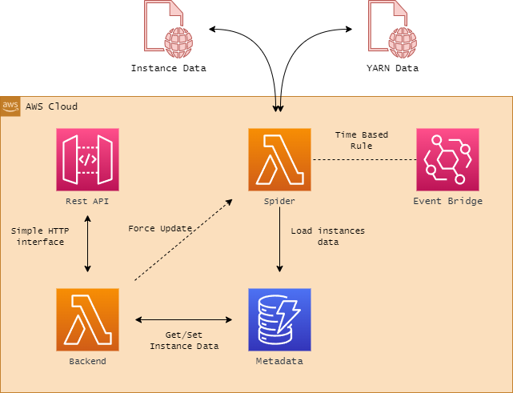
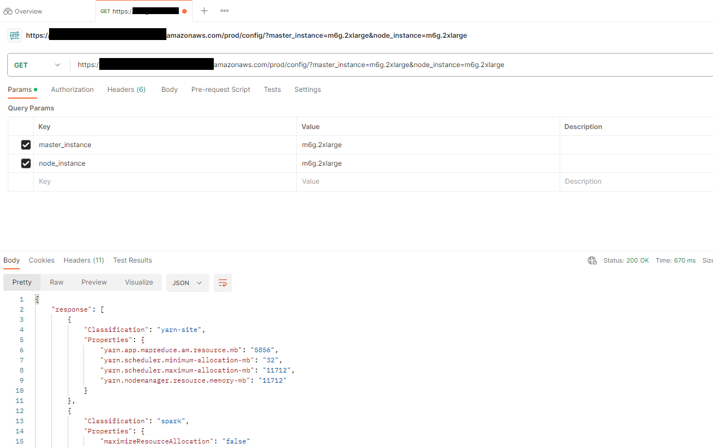
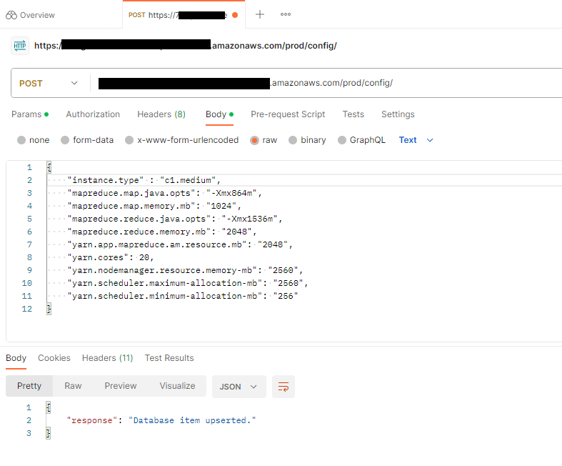

# EMR Config Builder

An easy manner to generate Apache Spark optimized AWS EMR cluster configurations using a REST API.

Service created using Python, Poetry, and AWS CDK.

All variable calculations are based on this AWS [tutorial](https://aws.amazon.com/pt/blogs/big-data/best-practices-for-successfully-managing-memory-for-apache-spark-applications-on-amazon-emr/). 


## Requirements

| **Software**    | **Version** |
|-----------------|-------------|
| Python          | 3.8.x       |
| Poetry          | 1.6.1       |
| CDK (on Poetry) | 2.99.1      |
| Docker          | 24.0.2      |
| AWS cli         | 2.13.3      |


Setup you AWS CLI environment.
```
aws configure
```
Do you don't know how to configure your AWS CLI Environment? Check [here](https://aws.github.io/aws-emr-best-practices/).

## Deploy

Deploy using cdk with poetry.
```
cd infra
poetry run cdk synth
poetry run cdk deploy
```

After deploy, you can wait `spider_lambda` runs (event bridge schedule), trigger manually or send a request to backend with following options.



This first step is necessary to feed the dynamodb table with instance informations.

## Design



## How to Request 

1. The backend will create a configuration using master and node parameters. 



Response:

```json
{
    "response": [
        {
            "Classification": "yarn-site",
            "Properties": {
                "yarn.app.mapreduce.am.resource.mb": "5856",
                "yarn.scheduler.minimum-allocation-mb": "32",
                "yarn.scheduler.maximum-allocation-mb": "11712",
                "yarn.nodemanager.resource.memory-mb": "11712"
            }
        },
        {
            "Classification": "spark",
            "Properties": {
                "maximizeResourceAllocation": "false"
            }
        },
        {
            "Classification": "spark-defaults",
            "Properties": {
                "spark.dynamicAllocation.enabled": "false",
                "spark.driver.memory": "4684M",
                "spark.executor.memory": "2635M",
                "spark.executor.cores": "8",
                "spark.executor.instances": "4",
                "spark.executor.memoryOverhead": "292M",
                "spark.driver.memoryOverhead": "1171M",
                "spark.executor.extraJavaOptions": "-XX:+UseG1GC -XX:+UnlockDiagnosticVMOptions -XX:+G1SummarizeConcMark -XX:InitiatingHeapOccupancyPercent=35 -verbose:gc -XX:+PrintGCDetails -XX:+PrintGCDateStamps -XX:OnOutOfMemoryError='kill -9 %p'",
                "spark.driver.extraJavaOptions": "-XX:+UseG1GC -XX:+UnlockDiagnosticVMOptions -XX:+G1SummarizeConcMark -XX:InitiatingHeapOccupancyPercent=35 -verbose:gc -XX:+PrintGCDetails -XX:+PrintGCDateStamps -XX:OnOutOfMemoryError='kill -9 %p'",
                "spark.default.parallelism": "12",
                "spark.serializer": "org.apache.spark.serializer.KryoSerializer"
            }
        },
        {
            "Classification": "mapred-site",
            "Properties": {
                "mapreduce.map.output.compress": "true",
                "mapreduce.map.java.opts": "-Xmx2342m",
                "mapreduce.reduce.java.opts": "-Xmx4684m",
                "mapreduce.map.memory.mb": "2928",
                "mapreduce.reduce.memory.mb": "5856"
            }
        }
    ]
}
```

Everything inside of `response` is ready to pass as a parameter to `run_job_flow` boto3 api.

All parameters:

    master_instance (required:str): Master instance type.
    node_instance (required:str): Node instance type.
    node_count (optional:int): Number of nodes used on cluster.
    master_yarn_cores (optional:int): Yarn cores availables to master for selected instance type.
    node_yarn_cores (optional:int): Yarn cores availables to node for selected instance type.
    cores_by_executor (optional:int): Cores for spark executor. (Spark configuration) 
    set_python3 (optional:bool): if you want use python3.
    set_spark_glue_catalog (optional:bool): if you want use integrated glue catalog.
    set_hive_glue_catalog (optional:bool): if you want use hive catalog.

## Update or insert a new instance data

You can face some scenarios when need to add a new configuration instance, following below how you can do that.

If you don't want a update from spider for those itens, create a custom config changing `instance.type` param value. 



All parameters are required.

When update or insert a dynamodb item a flag is added to prevent update from spider lambda.


